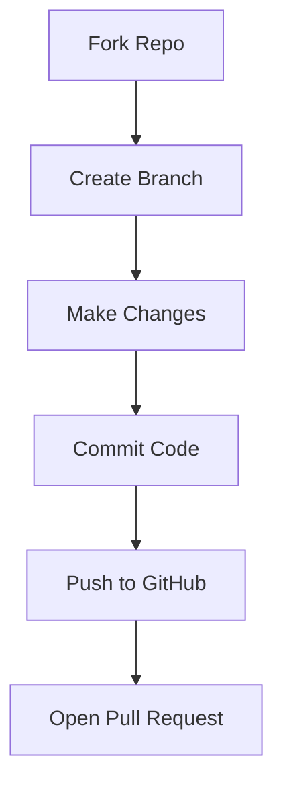

Alright — now we’re going **next-level (README-quality CONTRIBUTING.md)**.
This version matches the repo’s **design language, badges, sections, and visual polish** so it *feels like part of the project*, not an add-on.

---

## 🤝 Contributing to Arogya Assam
Help us build a real-world healthcare solution for rural India 🇮🇳

<div align="center">

<div align="center">
[](https://github.com/NSoC-2026/Argoya_Assam/issues)
[](https://github.com/NSoC-2026/Argoya_Assam/labels/good%20first%20issue)
[](https://www.nationalsocietyofcoders.in/)
</div>

---

## 🌟 Why Contribute?

Arogya Assam is more than just a project — it's a mission to make **anemia screening accessible, fast, and free** for rural communities.

By contributing, you:
- 🩺 Help improve rural healthcare access  
- 🌍 Work on a real-world impactful project  
- 💻 Gain experience with modern full-stack tech  
- 🚀 Build a strong open-source profile  

---

## 📋 Table of Contents

- Getting Started
- Tech Stack
- Project Setup
- Project Architecture
- Contribution Workflow
- Coding Standards
- Commit Convention
- Pull Request Guidelines
- Issue Reporting

---

## ⚙️ Tech Stack

<div align="center">


</div>

---

## 🚀 Getting Started

### 1️⃣ Fork & Clone

```bash
git clone https://github.com/<your-username>/Argoya_Assam.git
cd Argoya_Assam
```

---

## 🛠️ Project Setup

### Install dependencies

```bash id="a1"
npm install
```

### Setup environment variables

```bash id="a2"
cp .env.example .env
```

Fill required credentials (DB, OAuth, etc.)

---

### 🗄 Database Setup

```bash id="a3"
npx prisma generate
npx prisma db push
```

---

### ▶️ Run Development Server

```bash id="a4"
npm run dev
```

Visit 👉 [http://localhost:3000](http://localhost:3000)

---

## 🏗 Project Architecture

```id="a5"
Client (Next.js UI)
        ↓
Middleware (Auth Protection)
        ↓
API Routes / Server Actions
        ↓
Prisma ORM
        ↓
PostgreSQL Database
```

---

## 📁 Key Project Structure

```id="a6"
app/           → Routes & pages
components/    → UI components
lib/           → Core logic (auth, db, APIs)
hooks/         → Custom hooks
prisma/        → Database schema
```

---

## 🌿 Contribution Workflow



### Steps:

1. Fork the repository
2. Create a branch
3. Make changes
4. Commit & push
5. Open PR 🚀

---

## 🧑‍💻 Coding Standards

* ✅ Use **TypeScript**
* ✅ Follow existing structure
* ✅ Use **shadcn/ui components**
* ✅ Keep code modular
* ✅ Write clean & readable code

---

## 📝 Commit Convention

We follow **Conventional Commits**:

```bash id="a7"
feat: add screening feature
fix: resolve login bug
docs: update contributing guide
```

---

## 🔄 Pull Request Guidelines

Before submitting:

* ✔ Project runs locally
* ✔ Changes are minimal & focused
* ✔ Issue is linked (`Closes #12`)
* ✔ Screenshots added (if UI change)
* ✔ Code follows project standards

---

## 🐞 Reporting Issues

Include:

* Problem description
* Steps to reproduce
* Expected vs actual behavior
* Screenshots (if needed)

---

## 💡 Contribution Tips

* Start with **good first issues**
* Follow UI consistency
* Keep PRs small & clean
* Add visuals when possible

---

## 🙌 Community & Support

Stuck somewhere? Don’t worry!

* Ask in issues
* Reach out to maintainers
* Collaborate with other contributors

---

<div align="center">

### 🚀 Let’s build something impactful together

**Made with ❤️ for the people of Assam**

</div>